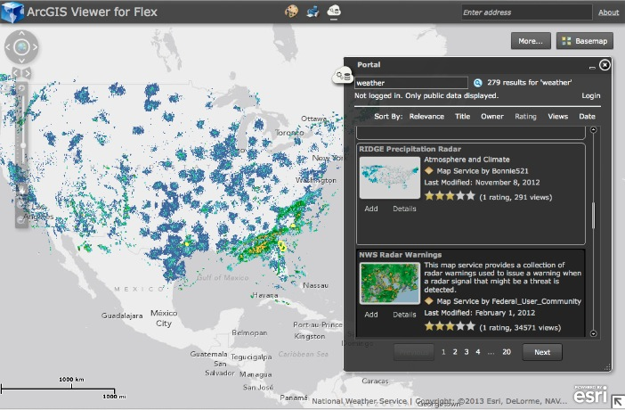

# portal-widget-flex

<!-- short description -->
This is the portal widget source code compatible with the [arcgis-viewer-flex (ArcGIS Viewer for Flex)](https://github.com/Esri/arcgis-viewer-flex "View repository on GitHub") application.

<!-- thumbnail with hyperlink -->

<!-- repository description -->
This repository includes:

* The [widget source code](viewer-PortalWidget/src/widgets/Portal) to showcase how to search for services from [ArcGIS.com][3] or [Portal for ArcGIS][1].
* The [Change Log](CHANGELOG.md) containing details about the repo history.
* The latest development is always on the [develop branch](../../tree/develop).
* The latest release is always on the [master branch](../../tree/master).

## Features
* This widget showcases the [Portal for ArcGIS API][2] and the ability to search for content on ArcGIS.com[3] or on-premises ([Portal for ArcGIS][1]).   
* Using this widget, you can:
    * Search for public services on ArcGIS.com.
    * Sign in to ArcGIS.com and search for services that have been shared with you.
    * Search for public services hosted with Portal for ArcGIS.
    * Sign in to Portal for ArcGIS and search for services that have been shared with you. 
    * Add these services to the ArcGIS Viewer for Flex.
    
## Instructions

#### Instructions for Uploading to Application Builder

1.  [Download the release][5] for Application Builder.
2.  Open Application Builder, and go to Settings --> Advanced Settings
2.  Go to Manage Custom Widgets, click Add
3.  Navigate to the AppBuilderX.X-PortalWidget-X.X.X.zip file, and select the file.
4.  The Portal Widget should be added and available for use in the Application Builder.

#### Instructions to Upload to existing FlexViewer

1.  Unzip the [AppBuilderX.X-PortalWidget-X.X.X.zip][5] file
2.  Create the directory src/widgets/Portal
3.  Copy the contents of the zip file into the src/widgets/Portal folder
    * assets
    * meta.xml
    * PortalWidget.swf
    * PortalWidget.xml  
4.  Change the PortalWidget.xml configuration parameters (listed below)
5.  Add a widget reference to the application config.xml file

#### Instructions to upload into source code

1.  [Download the source][6] from the tags or [clone the repo][7] (https://github.com/lheberlie/portal-widget-flex.git)
2.  Add the cloned or downloaded source code (e.g. /Users/Jack/Development/FlexViewer/portal-widget-flex/viewer-PortalWidget/src) to the **Source path** under the **Flex Build Path** in Adobe Flash Builder.
3.  Add the widget (PortalWidget.mxml) as a module to the **Flex Modules** in Adobe Flash Builder
4.  Modify the **Flex Compiler** settings with the **Additional compiler arguments** (see below)
    * -locale=en_US -source-path=locale/{locale}**,/Users/Jack/Development/FlexViewer/portal-widget-flex/locale/{locale}** -keep-all-type-selectors=true  
    * the section above in **bold** are the modifications that are necessary to localize the widget
    * You will need to create other locales other than English
4.  Change the PortalWidget.xml configuration parameters (listed below)
5.  Add a widget reference to the application config.xml file

#### PortalWidget.xml configuration parameters

* <arcgisonlineurl> -- can use either arcgis.com, or a Portal instance
* <tokenurl> -- the generateToken url, related to the <arcgisonlineurl> used
* <resultsperpage> -- how many results are returned per page search
* <defaultsearch> -- the initial search when the widget opens
* <defaultsortfield> -- the initial sort used, available options are ('','title','created','owner','avgRatings','numViews')
* <defaultsortorder> -- 'desc','asc'
* <columnsize> -- determines the size of the widget, 'full'=2 columns, otherwise 1 column
  
## Requirements
* Knowledge of Flex development.
* A little background with Adobe&reg;/Apache Flex&reg; SDK.
* Experience with the [ArcGIS API for Flex](http://links.esri.com/flex) would help.

## Resources
* [ArcGIS Viewer for Flex Resource Center](http://links.esri.com/flexviewer)
* [ArcGIS API for Flex Resource Center](http://links.esri.com/flex)
* [Flex Viewer License agreement](http://www.apache.org/licenses/LICENSE-2.0.html)
* [Flex API License agreement](http://www.esri.com/legal/pdfs/mla_e204_e300/english.pdf)
* [ArcGIS Blog](http://blogs.esri.com/esri/arcgis/tag/flex/)
* [@lheberlie](http://twitter.com/lheberlie)

## Issues
Find a bug or want to request a new feature?  Please let us know by [submitting an issue](../../issues "Submit an Issue").

## Contributing
Anyone and everyone is welcome to [contribute](CONTRIBUTING.md).

## Licensing
Copyright 2013 Esri

Licensed under the Apache License, Version 2.0 (the "License");
you may not use this file except in compliance with the License.
You may obtain a copy of the License at

http://www.apache.org/licenses/LICENSE-2.0

Unless required by applicable law or agreed to in writing, software
distributed under the License is distributed on an "AS IS" BASIS,
WITHOUT WARRANTIES OR CONDITIONS OF ANY KIND, either express or implied.
See the License for the specific language governing permissions and
limitations under the License.

A copy of the license is available in the repository's [license.txt](license.txt) file.
 
[1]: http://www.esri.com/software/arcgis/arcgisserver/extensions/portal-for-arcgis
[2]: https://developers.arcgis.com/en/flex/api-reference/index.html?com/esri/ags/portal/Portal.html&com/esri/ags/portal/class-list.html
[3]: http://www.arcgis.com/features/

[5]: https://github.com/lheberlie/portal-widget-flex/releases
[6]: https://github.com/lheberlie/portal-widget-flex/tags
[7]: https://github.com/lheberlie/portal-widget-flex